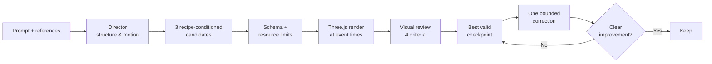

<div align="center">

# ⚡ autoV

### Prompt-to-VFX for real-time games — editable, not just pretty

**AI-authored Three.js effects you can actually open, tweak, and ship.**

[](https://github.com/team-v-gbc2026/autov)
[](https://nextjs.org)
[](https://threejs.org)
[](https://platform.openai.com)
[](https://supabase.com)

<br/>

<!-- DEMO VIDEO — replace the URL below.
     GitHub plays .mp4/.webm inline if you drag the file into an Issue/PR comment
     and paste the resulting https://github.com/user-attachments/... URL here.
     For a YouTube demo, use the thumbnail-link form instead (commented out under this). -->

https://github.com/user-attachments/assets/a8640ab5-a82f-42cb-ba82-29c4bb9d1e16

<!-- YouTube alternative:
<a href="https://youtu.be/VIDEO_ID"></a>
<br/><sub>▶︎ Watch the 90-second demo</sub>
-->

<br/>

<a href="docs/screenshots/vfx-studio-ui-chat-edit.jpg"></a>
<a href="docs/screenshots/vfx-studio-ui-effect-controls.jpg"></a>

</div>

---

## The one-liner

> **A game artist's VFX pass can now start from a prompt and end in an editable layer stack**, because OpenAI's Structured Outputs let us have the model author a *declarative effect document* instead of opaque code — so every spark, trail and shockwave stays yours to tune.

## The problem

Prompt-to-VFX tools give you a **video**. A video is not a visual effect. You can't retime it, recolor it, relight it, or drop it into an engine. The moment an art director says "make the trail 20% longer," you start over.

## The solution

autoV never lets the model write executable code. It designs a **bounded declarative document** (`autov.lab/1`) — layers, tracks, colors, emission shapes, timing — and a **fixed Three.js renderer** owns everything that actually runs. That one constraint buys us the whole product:

|  | What you get |
|---|---|
| 🎚️ **Editable** | 18 layers, independent color / scale / rotation / opacity / local-time animation |
| 🔀 **Three directions** | Distinct candidate compositions per prompt, not three rerolls of one idea |
| 👁️ **Rendered critique** | Effects are actually rendered, then reviewed on four criteria — no blind generation |
| 🎯 **Scoped edits** | A chat edit touches exactly one layer in one time window. Everything else is bit-identical |
| ↩️ **Undo / redo** | Immutable best-state checkpoints — a bad refinement can never destroy good work |
| 📦 **Portable** | JSON import/export, plus a self-contained single-file HTML player |

## How it works



The renderer ships seven fixed primitives — annular ring, Fresnel noise shell, crescent trail, energy beam, glow/smoke sprite, analytic instanced particles, engraved decal — with HDR bloom and ACES tone mapping. GPU particles use hash-derived birth attributes and closed-form drag + gravity, so there's **no simulation state and no model calls during playback**. Scrub the timeline; it's deterministic.

Grounded in [ParticleGen](https://arxiv.org/abs/2608.00629) (plan/parameterize split, rendered critique, bounded refinement) and [KinemaFX, UIST 2025](https://arxiv.org/abs/2507.19782) (explicit motion intent, user-selected directions) — adapted to Three.js, not reproduced. See [DESIGN.md](docs/vfx-lab/DESIGN.md) for the honest boundaries.

## Quickstart

```bash
git clone https://github.com/team-v-gbc2026/autov.git
cd autov
cp frontend/.env.example frontend/.env.local   # add your OPENAI_API_KEY
npm --prefix frontend ci
npm --prefix frontend run dev:local
```

Open **[127.0.0.1:3000/dev/vfx-lab](http://127.0.0.1:3000/dev/vfx-lab)** — a dev-only route that needs no Supabase login.

The product studio lives at `/workspace` and does require Supabase; on localhost it routes generation through `/api/local-vfx`. Add a key via `/dev/vfx-lab/settings` or `frontend/.env.local`. A server-side ledger hard-stops calls before the approved cumulative **$30** local spend limit.

📖 [Local setup & controls](docs/vfx-lab/LOCAL_SETUP.md) · [Architecture & limitations](docs/vfx-lab/DESIGN.md) · [App & database](docs/APP_DATABASE.md)

## Stack

`Next.js 16 (App Router)` · `React 19` · `Three.js r186 (WebGL2)` · `OpenAI SDK` · `Supabase` · `Zod` · `Tailwind v4` · Deployed on Vercel

<details>
<summary><b>Deploying to Vercel</b></summary>

Set the Vercel project's **Root Directory** to `frontend` — Vercel then detects the Next.js app and its lockfile correctly. `frontend/vercel.json` pins install to `npm ci` and build to `npm run build`.

| Env var | Where | Notes |
|---|---|---|
| `OPENAI_API_KEY` | `.env.local` (local) / Vercel env vars (prod) | Use your own key and your own hackathon credit locally. The production key lives only in Vercel. |

</details>

## 🔒 Security — read before your first push

This repo is **public**. Treat everything you commit as permanently readable by anyone.

- **Never commit API keys or tokens.** GitHub push protection will reject it anyway — if it fires, remove the secret and *rotate the key* rather than working around it.
- `main` is protected: no direct pushes, no force-push. Branch → PR → 1 approval → merge.
- Every PR is scanned by **gitleaks** and **CodeQL**. A high-severity CodeQL finding blocks the merge.
- Want an AI review? Comment **`@coderabbitai review`** on your PR.
- 2FA is required for every member of this org.

Full rules and reasoning: **[SECURITY.md](SECURITY.md)** — 2 minutes, please read once.

## How we work

- One task = one GitHub Issue. Board: **Projects → Team V! Board**
- `main` deploys to prod. Small branches, small PRs, one approval
- New commits dismiss earlier approvals — push everything *before* asking for review
- Stuck 15–30 min? Post in `#dev` on Discord
- Decisions go in [`docs/DECISIONS.md`](docs/DECISIONS.md), not just chat

## Team V!

| | Name | Role | GitHub |
|---|---|---|---|
| 🎯 | Taiki Kawa | Lead / PM | [@TaikiKawa](https://github.com/TaikiKawa) |
| 🛠️ | Eric Volkmann | Engineer | [@gd193](https://github.com/gd193) |
| 🛠️ | Rahul Ghosh | Engineer | [@SYBIOTE](https://github.com/SYBIOTE) |

## Roadmap

- **Engine export** — Niagara / Unity VFX Graph emitters from the same document
- **Renderer primitives** — soft-particle depth intersection, curl integration, spline trajectories
- **Human benchmark** — the visual model's score is *not* a certification of AAA quality. That needs artists.

---

<div align="center">
<sub>Built in 100 hours for the <b>TAI × OpenAI Game Builder Challenge 2026</b> · Track 2: Game Development Tools</sub><br/>
<sub>Showcase: Thu Sep 17, 18:00 @ Sakura Deeptech Shibuya</sub>
</div>
