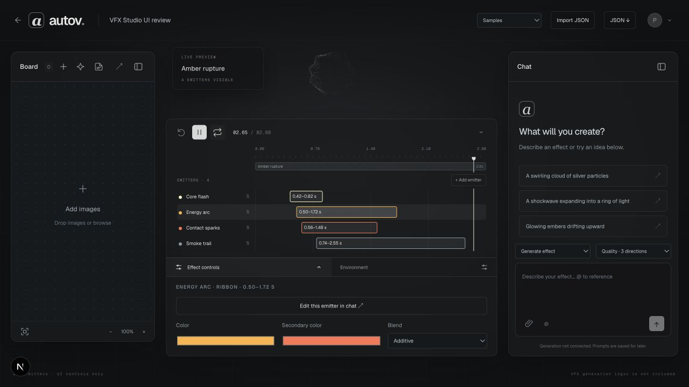
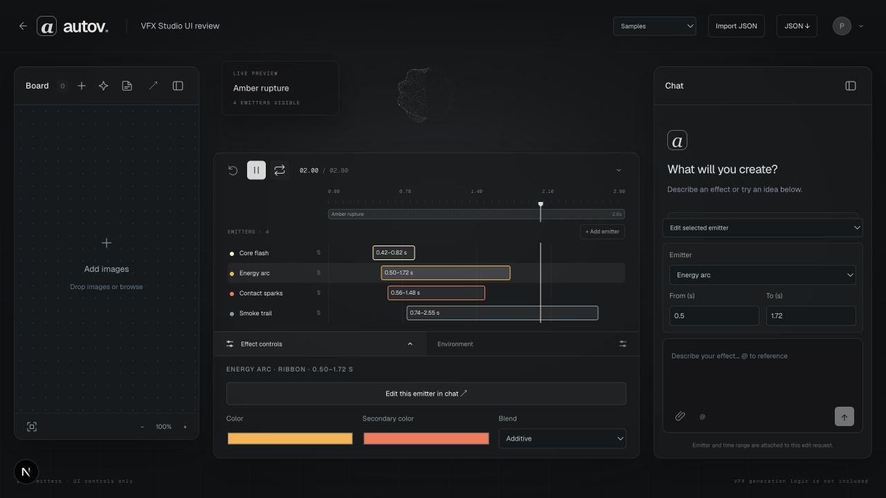

# VFX Studio UI review fixture

This branch includes a temporary, interactive review route at `/dev/vfx-ui-review`, available only in `next dev`.
`page.dev.tsx` routes are excluded from every production build (see `next.config.ts` and
`scripts/verify-dev-excluded.mjs`), so the fixture exists on a local dev server only. Remove the
fixture route after UX sign-off and before merging.

## Why this fixture exists

The emitter timeline is easier to evaluate by interacting with it than by
reading a static diff. The fixture uses sample UI data and the current `main`
studio shell, so reviewers can inspect the proposed workflow without the VFX
generation pipeline, OpenAI calls, or new rendering logic.

## Design decisions to review

- The timeline absorbs the old Layers-tab responsibility: it lists every
  emitter and owns selection, show/hide, solo, timing, and overlap.
- Effect controls are not a second layer list. They edit parameters for the one
  emitter selected in the timeline. Environment remains scene-level.
- The right chat panel attaches an explicit emitter and From/To seconds to an
  edit request. The request appears as a marker on that emitter row.
- Samples and Import JSON stay in the top-right so a document can be chosen
  before generation is connected.
- Opening the timeline or either control shelf reduces the preview area. The
  existing renderer observes that size change and fits the complete effect into
  the remaining space instead of letting the panel cover it.
- The current Board and profile menu from `main` remain in place. No UI removal
  or regression from the older VFX branch is intended.

Three Nebula emitter examples are useful direction for the later implementation
pass: <https://three-nebula.org/examples/emitter-behaviors/>. This PR does not
add Three Nebula or generation/runtime logic.

## Suggested review flow

1. Open `/dev/vfx-ui-review` on a local `next dev` server (dev-only routes are excluded from deployments).
2. Select different emitter rows, then try show/hide and Solo.
3. Add an emitter and open Effect controls to change its presentation values.
4. Click **Edit this emitter in chat**, choose the emitter, and set From/To
   seconds before entering an edit prompt.
5. Open Environment and compare its scene-level role with selected-emitter
   controls.
6. Switch Samples and inspect Import JSON / JSON export in the top-right.
7. Collapse and reopen the timeline and confirm the full effect scales between
   the large and small preview areas.

## Screenshots

