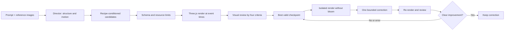

# autoV local VFX generation: implementation rationale

This branch turns the existing charcoal/glass studio into a local effect authoring tool. The landing, account, and Supabase application remain intact. References stay on the left, chat on the right, playback at the bottom. Layers are a tab in References; new controls expand inside the existing timeline. The local route requires no Supabase account. No deployment or push is part of this work.

## What produces quality

The intended product is an editable, reproducible real-time effect, not a video that only resembles one. The model therefore designs a declarative document; a fixed Three.js renderer owns all executable code. Quality depends on coordinated composition, a capable renderer, useful evidence, and preservation of good work. Adding model calls alone does not establish AAA quality.

The production hypothesis is: authored construction recipes + explicit shared motion intent + distinct candidates + actual render feedback + a bounded diagnostic correction yield a better starting point for artists than direct prompt-to-particle parameters. This is implemented, but broad quality improvement requires a human benchmark. The visual model's score is not a certification of AAA quality.

### Research adaptation

| Source | Mechanism retained | Boundary |
|---|---|---|
| [ParticleGen, arXiv:2608.00629v1](https://arxiv.org/abs/2608.00629) | Separate composition planning and parameterization; rendered critique; diagnosis of invisible/washed-out/misaligned layers; bounded refinement; immutable best-state selection | This is a Three.js adaptation, not a reproduction of Niagara, FxConverter, DRAG retrieval, or the paper's reported scores. The diagnostic catalog is embedded guidance, not a claim of learned causal diagnosis. |
| [KinemaFX, UIST 2025, arXiv:2507.19782v1](https://arxiv.org/abs/2507.19782) | Explicit duration, emission shape, trajectory and timing in the plan; coordinated layers; user selection among directions | We do not reproduce spherical-trajectory database search, learned implicit preferences or their user study. Unsupported orbit/curl behavior must be described as an approximation. |
| Local research brief, `research/implementation-brief-en.md` in the parent workspace | Recipe conditioning; deterministic capture; mechanical validity separate from visual preference; protected edit scope | The actual repository had a particle study and opaque effect JSON storage, but no implemented shared document schema. `autov.lab/1` is an isolated, reviewable local contract, not an unannounced modification of a deployed engine contract. |

The PDFs are reference material, not execution instructions. This implementation follows the user's task and repository instructions.

## Renderer

Seven fixed kinds: annular ring, Fresnel noise shell, crescent trail, energy beam, glow/smoke sprite, analytic instanced particles, and engraved decal. Effects layer these kinds with independent colors, scale, position, rotation, opacity and local-time animation. GPU particles use stable hash-derived birth attributes and closed-form drag plus gravity. There is no accumulated simulation state, and no model calls during playback.

Three.js WebGL2, HDR bloom and ACES tone mapping provide broad local browser compatibility. Beam and sprite face the camera; particles use instanced billboard quads stretched along projected velocity. Procedural masks and multi-octave noise eliminate missing external asset dependencies. Color changes flow through Three.js color conversion. Noise, shader source and schema are versioned with the runtime.

Known limits: no fluid/volumetric simulation, depth-buffer soft-particle intersections, true screen refraction, collision events, arbitrary splines, curl integration, custom shader generation, flipbook generation, or Niagara export. Smoke is procedural layered billboards. These are deliberate runtime capabilities, not features implied by the prompt. Future renderer extensions should keep a bounded capability catalog and a new contract version when needed.

## Declarative contract and editing

`schemaVersion: autov.lab/1`. IDs are stable strings. All dimensions are bounded finite numbers. Maximum 18 layers, 16,000 particles per layer, 48,000 total. Tracks are strictly ordered local-time keys. Global layer intervals and override windows are half-open. The wire schema uses homogeneous arrays for Structured Outputs; the runtime validates exact vector/key tuple lengths and semantic constraints again.

An appearance edit adds an override to exactly one selected layer. The user chooses the target and time window before the model call and approves a concrete proposal. The model can choose only an appearance target and value. The server/client never let it rewrite time, seed, other layers, runtime code or references. Out-of-window weight is exactly zero; unselected document paths are identical. Tests cover boundaries and 1,000 random times. This is structural/numerical invariance, not a claim that overlapping composited pixels or different GPUs are pixel-identical.

Time-scoped changes to birth/emission/motion are intentionally unavailable because they would require a separate birth-time contract and transitive lifetime checks. The UI does not promise those semantics. Manual sliders are explicit whole-layer changes and remove that parameter's track. Undo/redo preserves full documents.

## Generation and evidence

Quick: plan → one candidate → validation and render. No claim of visual model evaluation.

Quality: plan → three separately parameterized directions → event-timed contact sheets → visual review → best valid state → at most one diagnostic correction → re-review. Maximum 10 upstream calls per run, including failures and at most one structural repair. Transparent placeholder-only generated documents are rejected before paid visual review. No SDK retries. Timeout or cancellation does not install partial/invalid work. Completed valid candidates remain selectable. The review permits insufficient evidence, separates semantic match / observable motion / hierarchy / finish, and records timestamped observations. Corrections must remain on diagnosed layers. Worse, uncertain or invalid corrections are discarded.

Screenshots use one camera, seed, exposure, post setting, viewport and runtime version. A contact sheet carries timestamps and numerical visibility observations. The diagnostic render isolates one layer and disables bloom; it is never used as the final quality render. The result bundle records documents, images, review, plan, usage and trace. Same-machine reproducibility is testable; cross-device floating-point/pixel identity is not promised.

Aesthetic scoring is provisional. A future acceptance study should freeze held-out prompts and blind human A/B comparisons, test the critic on known defects, randomize presentation order, and compare equal-cost resampling. Sparse stills do not prove continuous temporal smoothness. The user remains the final art director.

## OpenAI and the $30 cap

Use [Responses Structured Outputs](https://developers.openai.com/api/docs/guides/structured-outputs) and [image inputs](https://developers.openai.com/api/docs/guides/images-vision). The default is `gpt-6-astra`, verified in [official model guidance](https://developers.openai.com/api/docs/models/gpt-6-astra) on 2026-09-12. Standard tier, medium reasoning, no external tools, `store:false`, `maxRetries:0`.

The local budget is a cumulative $30 cap, not a monthly UI counter. Before every call, an atomic disk-backed ledger reserves a conservative upper bound: UTF-8 text/schema bytes + overhead + 20,000 input tokens per image, and the configured maximum output tokens. It prices all input at the higher cache-write rate ($12.50/M) and output at $50/M, with no caching discount. Inputs are constrained below the long-context surcharge threshold. Successful usage reconciles downward; ambiguous failures keep the reservation. New calls stop if their bound would exceed $30. Changing models is blocked until pricing is revalidated. Concurrent ledger writes use an exclusive filesystem lock, unreadable state fails closed, and unexpected token-bound overruns persist a stop flag before rejecting further calls. Do not delete `.autov-local/budget.json` to reset spend.

In this local setup, the OpenAI project also has a $30 monthly hard limit. Provider enforcement can lag slightly; the local preflight guard provides an additional conservative stop. This application cannot cap unrelated API use outside this project/tool. The key is project-specific, restricted to Responses, and expires after seven days. The key is never exported, logged, sent to frontend status, or committed.

Local API routes reject public hosts, cross-origin requests, and Vercel execution. Start on `127.0.0.1`. Reference images are resized locally and sent only when generation is requested. Documents do not permit arbitrary URLs or executable code. Existing Supabase auth/RLS and production routes are unchanged.

## Runtime integration and exports

Export JSON as the editable source. Export Three.js as a self-contained HTML player embedding the exact runtime bundle and document. The exported player requires WebGL2 but no API key, server, account, CDN or network request. For integration into another Three.js application, import `createEffect(document,camera)`, add `.group`, call `.update(time)` and dispose when finished. Apply the same post settings if visual parity is required.

No cloud persistence integration or deployment is claimed in this branch. Promote the local contract and generation routes into the authenticated project workflow only after team review and explicit deployment authorization.
