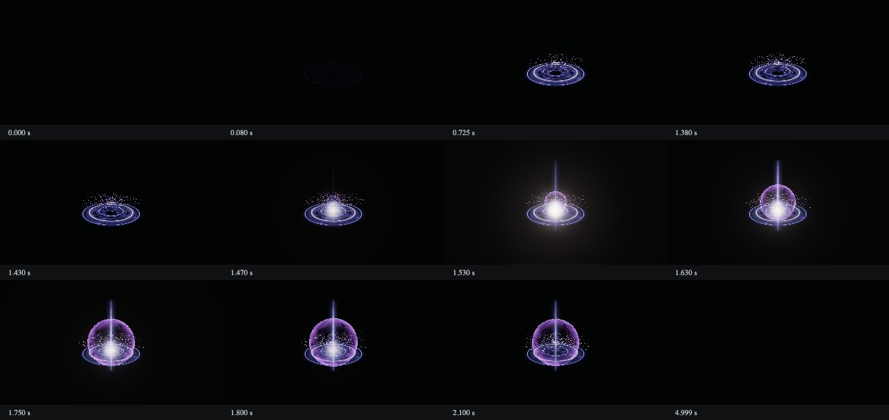

# Integrated VFX studio

For the final overnight counts, measurements and limitations, see [OVERNIGHT_RESULTS.md](OVERNIGHT_RESULTS.md).

This branch retains the VFX generation pipeline from `codex/vfx-generation-studio` and merges the emitter timeline UI from `feature/vfx-studio-ui-add-emitter-timeline`. At integration, `main` was `0b97b55` and already an ancestor of the generation branch (`a75ddbc`). The initial UI source was `98086ce`; its subsequent update `c82e94f` is also merged. Both histories are preserved by a merge, not file replacement.

## Run and review

```sh
cd frontend
npm ci
npm run dev:local
```

Open `http://127.0.0.1:3000/workspace`. Local generation remains localhost-only; the Supabase-backed workspace and main's reference Board remain available with the original deployment behavior. This work does not deploy or expose the local key endpoint publicly.

The real renderer now uses the newer timeline presentation, Add emitter, selection/solo/visibility, scoped-edit markings, effect/environment tabs and a measured preview area. Mesh, surface and texture controls update the actual document. Undo/redo, references, generation, JSON import/export and standalone Three.js export remain connected.

`Presets → Generated texture demo` loads a deliberately authored effect that uses an actual Codex-generated PNG in a shader. It is explicitly labeled as a demonstration, not a live API generation or a benchmark pass. The mask and provenance are in `frontend/public/textures/`; the self-contained document is in `frontend/public/examples/`.

## Generation changes

- Parameterized meshes: plane, teardrop, cone, crystal, torus, curved ribbon, anchored streamer and seeded branched lightning, alongside the original sphere and instanced particle billboards. No external 3D inference service or executable generated code is introduced.
- Layer-local XYZ motion keys are evaluated directly at the requested time, preserving arbitrary seeking. Mesh rotation/UVs have fixed budgets. Motion describes the emitter transform; it is not a world-space particle simulation.
- Surface variants add directional flame erosion, water streaks, hexagonal cells, rounded smoke, star masks, solid mesh shading and a rectangular portal.
- Construction examples now include lightning, projectile, smoke, sustained beam and portal so the model is not shown only slash/magic/explosion templates.
- Optional texture stage: plan up to two complementary grayscale masks → generate each at most once per run → validate/downsample/retain alpha → cache by prompt, references and model → attach by stable layer IDs → decode before rendering → embed in JSON and exported HTML. The shader uses luminance × alpha as a tintable emission/opacity mask. Particles currently use procedural billboards; generated textures bind to surface layers.
- Image API defaults to `gpt-image-2.5-sunburst`; `OPENAI_IMAGE_MODEL=gpt-image-2.5-flare` is also supported. An unavailable image model or invalid texture does not destroy the procedural candidate. No automatic model substitution or paid retry is performed.
- Critic now receives the input reference images **and** the output contact sheet, clearly separated. It previously received only the sheet. Sampling includes each short primary event, reducing missed staggered strikes. Blank rendered outputs are rejected.
- A refinement may replace the best candidate only if the weighted score improves, passed criteria remain passed, failures do not increase, and no formerly adequate axis falls below 3. The previous valid candidate remains available after failures.
- The fixed oblique camera is fitted to the sampled animation envelope. Oriented geometry is projected directly into camera coordinates, avoiding excessively loose bounds for billboards. It does not follow the effect during playback. Capture times cover growth, sustain, breakup and decay as well as brief primary events.
- Codex-generated sigil, sculpted smoke and connected fire masks form a reusable library. The planner selects a compatible asset or requests a custom Image API asset. `OPENAI_IMAGE_MODE=library` explicitly limits this stage to existing assets when the key lacks image permissions. Provenance distinguishes reuse from a new API image; no successful image API call is implied by fallback. Textured smoke preserves its alpha and broad shading, and procedural smoke shading preserves crescent geometry for wisps.

## Local trial gallery

Open `/local/trials` or follow **Trials** in the studio. All generated candidates, including rejected refinements, retain their input prompt, references, document, sheet and review. Reopen an effect in the editor or download its JSON. The benchmark archive also produces videos and self-contained interactive players.

```sh
# Run from frontend; FFmpeg and ffprobe must be installed.
node scripts/build-trial-gallery.mjs
node scripts/verify-trials.mjs
```

The static `.autov-local/trials/index.html` works from the filesystem after the server stops. Each benchmark run keeps a snapshot of its renderer, so subsequent rendering changes do not silently rewrite historical trials. Video export samples the actual runtime at `n/30` seconds and verifies the encoded frame count/rate with ffprobe. This produces 30fps comparison videos even on slow software rendering; it is **not** a claim of 30fps real-time hardware performance. Private benchmark media and trial data stay out of Git; the gallery implementation and reusable generated texture library are shared.

## Spending and assets

Text and image calls use one cumulative local ledger, defaulting to $30. `OPENAI_VFX_BUDGET_USD` can configure an explicitly authorized limit up to $60. Changing the limit preserves all prior entries and pending reservations. `AUTOV_DATA_DIR` can point multiple local checkouts to the same ledger. Images reserve $2 before sending a request; settlement uses returned token usage and official input/output rates. Definitive authorization/validation rejections settle at zero; missing usage and interrupted requests stay reserved. A reservation overrun halts further generation. This is an application reservation, **not** a provider-enforced billing cap.

Do not copy a new empty ledger over a used one. A separate checkout has a separate `.autov-local` directory; preserve the intended cumulative ledger when moving an existing API configuration. Keys, source benchmark media, per-run results and ledgers are ignored by Git.

## Benchmark runner

The user-supplied `effect-benchmark-v1-full.zip` contains **17 cases** (34 text-only/text-image inputs). An older pre-existing extracted folder had 11 cases; it is not the source used for the integration audit. Always use the supplied archive's complete extraction.

```sh
# Read inputs only; no paid calls. Run from frontend/.
npm run benchmark -- --dataset /path/to/extracted-benchmark --split all --max-cases 17

# After configuring a key and authorizing spend:
npx playwright install chromium
npm run benchmark -- --dataset /path/to/extracted-benchmark --split dev --cases fx10-stylized-lightning,fx12-smoke-burst --mode quality --textures --live

# Freeze implementation before using validation/holdout as a final evaluation.
npm run benchmark -- --dataset /path/to/extracted-benchmark --split holdout --max-cases 5 --final-evaluation --live
```

The runner calls the **same** `generatePipeline` and local API used by the UI. It supplies exact prompts and reference images, not evaluation answers, source videos, or screenshots as replayed output. It records input hashes, revision/dirty state, candidates, reviews, usage, selected document, contact sheet, timestamped frames, a WebM of the real renderer, seek/extinction/shader gates and renderer details. Output defaults to `.autov-local/benchmarks/latest`.

Visual acceptance is not inferred from schema tests or a model score. Records remain `pending_visual_review` with an unset reviewer. Check the supplied evaluation rubric, critical checks, full video and reference stills separately. SwiftShader checks correctness; its timing is not representative of game hardware. Live benchmark generation was not run during the first implementation checkpoint because paid API budget authorization was pending. Input audits and authored renderer fixtures must not be reported as benchmark generation results.

## Verification

```sh
npm test
npm run typecheck
npm run lint
npm run build
npm run verify:runtime
npm run verify:browser
```

First checkpoint: 51 unit tests and 9 browser fixtures passed. The subsequent trial-gallery checkpoint adds persistence/path validation and cumulative-budget migration checks. Actual live dev trials are now saved locally; their model reviews have identified remaining size, accent hierarchy and late-wisp defects. No 17-case fidelity pass is claimed. Use the current test output and private trial reports for the latest counts.



`verify:browser` exercises the real UI, every construction example, texture decoding/sampling, deterministic seeking, end-time extinction, and an offline exported player with HTTP(S) blocked. `AUTOV_TEST_URL`, `AUTOV_CHROME_PATH` and `AUTOV_PLAYWRIGHT_MODULE` can target an existing local test server/browser installation. Evidence is saved under `.autov-local/renderer-verification`.

## Design sources and limits

- [OpenAI image generation guide](https://developers.openai.com/api/docs/guides/image-generation): image/edit endpoints, model IDs, transparent PNG and output configuration. [Sunburst model/rates](https://developers.openai.com/api/docs/models/gpt-image-2.5-sunburst). Confirmed September 13, 2026.
- [ParticleGen](https://arxiv.org/html/2608.00629v1): motivates separating composition, rendering and bounded visual refinement. No claim that its Niagara results transfer quantitatively to this Three.js implementation.
- [KinemaFX](https://arxiv.org/html/2507.19782v1): motivates explicitly representing motion rather than relying on appearance words alone.
- [Three.js documentation](https://threejs.org/docs/): existing Three.js primitives and custom BufferGeometry. No additional 3D model-generation runtime has been installed.
- [Riot VFX style guide, Shapes](https://nexus.leagueoflegends.com/wp-content/uploads/2017/10/VFX_Styleguide_final_public_hidpjqwx7lqyx0pjj3ss.pdf): readable silhouettes and concise texture detail inform the mask design. No copyrighted texture assets were copied.
- [Alex's toon-smoke shader tutorial](https://blog.ldev.app/building-a-toon-smoke-particle-shader-in-shader-graph/): broad highlight/shadow regions and local-space deformation inform the separation of silhouette, shading and motion. This implementation uses its own shaders and generated masks, not the downloadable Unity graph.

The procedural smoke/fire examples are editable construction guides, not proof of reference fidelity. Meshes and alpha masks widen the available representation; particle collision, fluid simulation, world-space trailing and arbitrary model synthesis remain outside this renderer. No OSS dependency is claimed to be absolutely safe; the change uses existing Three.js and adds explicit pinned Sharp (already transitively present) plus Playwright for verification.

Quality runs now retain every rendered refinement, including a repair whose critic request fails. After scalar correction, a poor result with a diagnosed shape/timing problem can receive one structural repair of at most three existing layers. The repair cannot change the seed, global duration, assets or unrelated layers. Postprocessing can only decrease when washout was diagnosed. The original remains selected unless re-review improves the weighted score by more than 0.15 without losing previously passed criteria or adequate axis scores. These are automated selection checks, not human fidelity acceptance.

Local trial detail pages can show the reference video next to the editable output. Source videos are attached only by the post-generation archival tool; the generation input remains the supplied prompt and input reference images. Normal studio trials also save an offline HTML player. The video files and trial inputs stay in the ignored local archive.

Water construction adds a bounded `streamer` membrane: the root stays attached while the free end bends deterministically in the vertex shader. The renderer adjusts normals for that deformation and includes its maximum displacement when fitting the fixed camera. Rounded heads use a sampled smooth lathe profile; water material uses continuous colored surfaces and broad moving highlights. These are procedural meshes, not downloaded/generated full 3D models.

The representation follows the separation of body, splash meshes and material motion described in [1MAFX's water projectile breakdown](https://www.1mafx.com/blog/water-projectile-vfx-breakdown). Its [fire projectile breakdown](https://www.1mafx.com/blog/fire-projectile-vfx-breakdown) also separates a stretched body, deformation and flame/smoke trails. We implement the mesh and deformation locally; no tutorial asset or shader source is copied. The smoothing uses the existing Three.js [CatmullRomCurve3](https://threejs.org/docs/pages/CatmullRomCurve3.html) and lathe geometry.

Candidates are now saved immediately after each successful render, before further paid review/generation steps. The studio and benchmark browser use the same archive API, so an interrupted later stage does not erase completed candidates. Long-lived primary shapes also receive two late-decay samples in the bounded event-timed contact sheet, while short strikes retain early active samples.

The texture planner may select up to two distinct masks when needed. The generated smoke-curl asset supplies an open hook for separated wisps while smoke-lobe supplies compact secondary billows and smoke-column supplies a continuous main plume. Camera fitting uses the alpha extent of textured smoke/flame planes, with a conservative animation margin, so transparent padding does not shrink the visible effect. Historical trial documents, sheets and renderer snapshots are retained.

On macOS the browser tools now prefer Metal; `AUTOV_BROWSER_ANGLE=swiftshader` explicitly selects software rendering. `node scripts/profile-playback.mjs /path/to/effect.json` records the actual renderer, resolution, animation-frame intervals and synchronous render times. This is separate from deterministic video encoding. A local Apple M3 Pro probe of the generated fire trial measured approximately 60fps at 960×540; this one scene/device result is not a general performance guarantee.

The latest UI branch update (`c82e94f`) is also merged. Its Supabase cookie filtering is adapted to retain the SDK's split session cookies and fixed/per-flow PKCE verifier cookies for the current project. Tests reconstruct a long session with the actual SDK chunk helpers. Authenticated cloud login still requires the deployment's Supabase configuration; local generation tests do not claim to verify that external login flow.

Further development-case feedback produced a highlight-only water material (`water-streaks`), rounded water membrane tips, stronger bounded deformation, and angular ring erosion that actually opens fading gaps. A fixed-parameter browser fixture verifies that erosion changes the ring's rendered pixels. A promising scalar proposal that cannot yet be adopted can now seed the next structural repair; final adoption still compares against the accepted baseline. Critic responses must cover the complete original criteria in order.

`node scripts/build-morning-review.mjs` creates an offline case overview under `.autov-local/morning-review`, including pending cases, current selections, earlier trials, source-video comparisons and editable players. No benchmark inputs or trial results are committed.

The flow7 renderer addresses defects observed in live trials: wide ring glow fades to zero within its circular support instead of clipping at the carrier quad; stars use straight polygon edges; portal rim width is measured in meters and can be refined. The optional `energy-ribbon` surface supplies a continuous core and saturated edges without longitudinal noise holes. `circle-eyes` renders a circular outline and two attached eyes as one lightweight editable sprite, avoiding independently drifting facial components. Both are procedural surfaces, not new generated bitmap assets. Historical trial videos retain their original renderer.

Ice-area trials exposed another representation limit: several individually generated needle meshes left most of the target area empty. `crystal-cluster` adds up to32 deterministic faceted crystals in one surface layer, with a fixed ground origin, editable footprint, individual width, height and count. Its bounded vertex data and camera envelope agree during width/radius/length animation. `ice` adds blue faces and white fracture contours. Normal-blended solid crystal/head meshes write depth so back faces do not overwrite front faces. No external asset download or 3D inference service is required.

`Presets → Generated smoke example` opens a real API-generated smoke candidate from the overnight development loop, with both generated masks embedded and all eight layers editable. The current example is a single-candidate fast probe using the continuous column and curl masks; it was visually compared but not automatically critiqued in that run. Its public document/provenance are under `frontend/public/examples/`. This intentionally shared output contains no benchmark reference images, source video, evaluator data or private usage ledger. It is an example, not a fidelity pass; the complete historical trial remains in the private archive.

The beam-edge library mask is another actual Codex-generated asset: two torn strips with an empty center, bound to a tinted plane alongside a separate continuous core. It addresses the smooth-bar silhouette seen in live beam trials. Water membranes now have rounded roots and view-dependent shading so head disappearance does not expose a rectangular cut. Morning case pages can include Japanese review notes keyed to the exact saved candidate, keeping historical observations separate from later variants.

## Focused refinement and temporal diagnostics

A quality run can now use `--candidate-count 1` (or 2) in the benchmark runner. This reduces the initial search breadth while retaining rendered critique, the scalar correction, and the bounded structural correction with the same rollback conditions. The studio's default quality mode still creates three initial candidates. Reports record the actual initial candidate count; focused runs should not be described as three-candidate searches.

Capture now also measures rendered RGB activity at 30 samples per second, at 160×90, against the final extinguished frame. The critic receives a bounded normalized curve and possible weak intervals or sudden drops alongside the 16-frame contact sheet. A weak interval is not proof of invisibility, and a deliberate impact can legitimately drop sharply. These measurements inform timing diagnosis; they neither certify smooth motion nor measure realtime FPS. Capture restores the previous grid visibility.

The generated `smoke-column` mask supplies one continuous primary plume with large merged billows. It complements the separate `smoke-curl` asset, reducing the need to stack many identical small puffs. Both the original mask and its preparation/provenance remain distinct from actual generated benchmark candidates. The director can select the column through the same texture stage and stable bindings as other library masks.

The composition-plan output allowance is 6,000 tokens, after a complex case exhausted the earlier 3,500-token allowance before producing an effect. Model requests have a bounded 240-second timeout and no SDK retries. Timeout reservations remain in the cumulative ledger because their remote billing is uncertain.

Morning review cards can use a frame extracted from the actual saved video. Failed retries are distinguished from completed generation. Optional playback measurements are displayed only when the measured JSON hash matches the selected document, and identify the renderer version and local device separately from the saved video's encoded frame rate.

## Secret-scan CI

The previous `gitleaks-action` launcher stopped before scanning because organization repositories require an Action license. CI now invokes the [MIT-licensed upstream Gitleaks CLI](https://github.com/gitleaks/gitleaks), version 8.30.1, with a pinned release SHA256, read-only repository permissions and redacted full-history scanning. No scan rules are disabled. This avoids introducing an organization license requirement for the separate Action; see the [Action's licensing documentation](https://github.com/gitleaks/gitleaks-action).

## Connected shields and cloud spirals

The hexagonal surface now uses the shared Voronoi boundaries of its triangular cell lattice. A connected-pixel browser fixture catches the previously disconnected lines. Textured explicit planes now honor UV spin as billboards do; three-dimensional meshes retain their geometric rotation. A two-time render check exercises a generated spiral mask and catches static UVs.

The new Codex-generated `vortex-cloud` mask supplies continuous broad spiral ridges, darker channels and a soft outer silhouette. Its library guide specifies plane orientation, physical aspect ratio, color contrast and rotation. It is a reusable material, not a benchmark output by itself. Explicit `--cases` lists preserve their requested execution order, allowing bounded remaining budgets to prioritize the most informative trials.

The offline review builder can link a hash-matched re-render of a historical document beside its original saved video. Such comparisons are labeled as renderer changes, not new API generations or re-scored benchmark candidates.

`node scripts/verify-morning-review.mjs` checks every offline case page, local links, video metadata and paired playback with external HTTP(S) blocked. `AUTOV_REVIEW_ENTRY` may point to a local launch/redirect HTML file.

Particle expiry now exits the vertex shader before fractional-power calculations; lifetime ratios, square-root and Fresnel bases have safe numeric domains. A 181-frame GPU fixture catches bloom contamination from invalid values. Video capture reads the completed framebuffer and reports GL errors. Corrected historical re-renders are labeled, retain original media and do not replace generation-time reviews.
